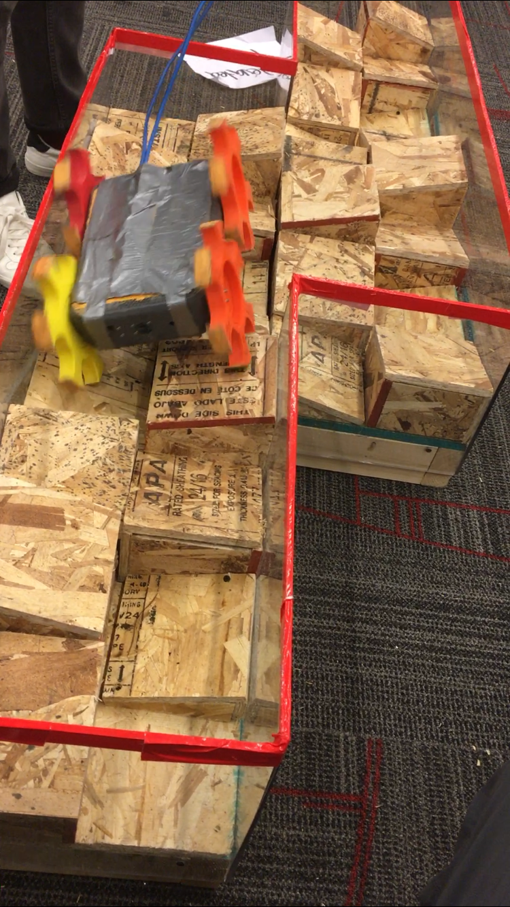

# TDM

**Logistical info**

>Team Name: RMRC BlueStorm

>Organisation: Mercersburg Academy

>Country: U.S.A.

>Contact person: Dr. Marcus Jaiclin

>Email:  jaiclinm@mercersburg.edu 

>Team website: https://github.com/mburg-dr-j/RMRC-BlueStorm

.

**Introduction summarising:**

>The team: Victor Li, 12th grade; Patrick Madden, 12th grade; Joseph Lieber, 11th grade; Marcus Jaiclin, Ph.D., Faculty mentor. 

>The technical aspects that it focuses on: Victor has been improving the image recognition algorithms. Patrick is working on the wireless communication and Joseph is working on improving the durability of the physical robot.

.

**System description, describing:**

>Hardware: The robot uses two Rasberry Pi model 3B+ to stream the two raberry Pi Cams and the thermal imaging camera, an arduino mega to control the 4 dynamixels (ax-12w). There is a speaker from a $1 gutted home phone that we bought in Montreal as well as a usb microphone connected to a Raspberry Pi.

>Software:***************************************************************

>Communications: The robot was able to communicate wirelessly through a 5ghz signal from our [router name], or it could be connected through two ethernat cable plugged into both Raspberry Pis.

>Human-robot interface: This was just a laptop that displayed the different programs while we used normal gaming keys(w,a,s,d) to control the robot.

.

**Application, describing:**

>Setup and packup of your robot and operator station: The operator station was a laptop connected to a router connected to the robot. The robot consisted of 2 Raspberry Pis stacked on top of eachother. these were connected to an arduino mega that controlled the servos.

>Mission strategy: To be able to traverse the course the quickest while implementing as many imaging based sensor points possible

>Experiments and testing that you have done or will do: running the robot through home built courses. Testing the hazmat and motion tracking sensors using the online recources.

>How the particular strengths of your team are relevant to applications in the field: We are able to traverse enviroments very quickly and take a great deal of abuse. Perfect for time sensiive situations.

.

**Conclusion:**

>What your team has learned so far: We have learned that keeping the design simple is imperative to our success. Also that thouroughly testing every part of our robot in competition like circumstances is needed in order to be prepared at the competition.

>What you plan on doing between now and the competition:**********************************************

.

**Appendix:**

 Component | Estimated Cost
 ----------|----------------
[arduino mega](https://www.mouser.com/ProductDetail/Arduino/A000066?qs=BC3YYPaifMrIue9b%252bHtKQg%3D%3D&gclid=Cj0KCQjwidPcBRCGARIsALM--eN8v65L1Oa7wp3lAjmWGikhGuY3MppZZ6ereN1YRN4TAOq24Qmx4N0aAtqjEALw_wcB)| $22
[3-cell(11.1V) Lipo Battery]()|
[4 x Dynamixel AX-12W](https://www.trossenrobotics.com/p/ax-12w-dynamixel-robot-servo.aspx?feed=Froogle&gclid=Cj0KCQjwidPcBRCGARIsALM--ePvoacYGdES8VoEXtqBKq1GnUcX1IFlbtcr-JInCoGgyg1OW942NOsaAlK1EALw_wcB)|$164.8
[Power Module]()|
[x2 Raspberry PI 3B+](https://www.dfrobot.com/product-1703.html?gclid=Cj0KCQjwidPcBRCGARIsALM--ePrw4qpy1WSF_i2oI3_BNTx80WOF0UjbCSBXMUfQPantufZuu_xCtoaAjLKEALw_wcB)|$80
[PiCam](http://www.microcenter.com/product/465935/Raspberry_Pi_Camera_Module_V2?src=raspberrypi)|$24.99
[x2 Ethernet Cable](https://www.monoprice.com/product?p_id=5905&gclid=Cj0KCQjwidPcBRCGARIsALM--eOVewPcyw5ijob6wHENVjCONQkVqlPGV5DEStqtwm2Bfp4aYLv3gEcaAur4EALw_wcB)|$26
[Netgear Nighthawk X4 Router]()
TOTAL: |

.

.

Open Source Hardware  

> The Arduino Mega

> The Raspberry Pi 3 and Pi cam

Open Source Software  

>Arduino IDE  

>‘ardyno’ library for Dynamixel servos on the Arduino. 

>Raspian operating system

References (to other work that you have made use of).

