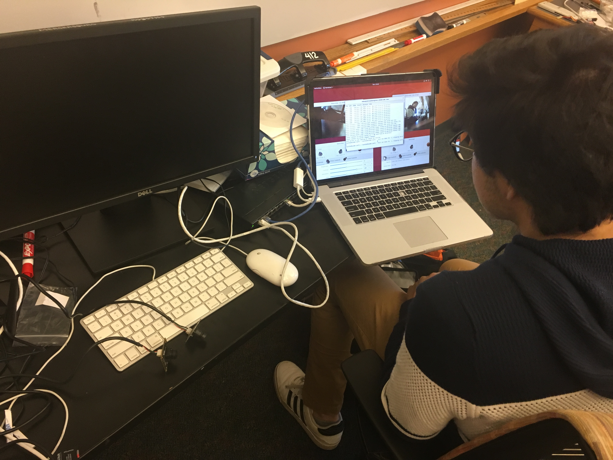

# Blog

**January 31st, 2019:**

>On this update you will see a list of every aspect of the design and components that was changed from the 2018 competition. If you wish to learn more about why and how an aspect was changed there will be an explanation of why it was changed and what benefits and disadvantages it provided in directory-links/2019-competiton-preparation/mechanical.

>>Thickness of the robot

>>Less Rounded corners

>>Motor Extrusions in each corner

>>Angled camera slots

>>Claw wheel design adjustment

>>Udoo X86 development board

>>Arm

>>CO2 sensor

>>Microphone array

>>Power Control Unit

>>Speaker

>>Dynamixel communication Board

>>Raspberry Pi 0

>>USB fish eye camera

>>USB 8 megapixel camera

>>External Ethernet Port

>>Dynamixel XM430W-350

**January 11th, 2019:**

>We were still unsatisfied with the speed of the XRDP Remote Desktop, and while having trouble connecting we searched for a new solution. We installed Ubuntu onto a mac, and open an ssh tunnel from the Ubuntu running the motors to the Ubuntu on the mac, using ssh -x (ip address) from the Mac to connect to the ubuntu. This worked phenomenally, with amazing fps running two cameras, although this is still through a wired connection. Furthermore, during the last update we were having trouble with the UDOO and having the Ubuntu side of the UDOO communicate with the Arduino side, as the Ubuntu was not seeing the Arduino as an output port to upload the code. We found [this guide](https://www.udoo.org/forum/threads/timeout-uploading-to-arduino-101.9891/#post-32686) that detailed a fix for it, and we were finally able to see the Arduino port. We have edited the motor code from last year, and now have a moving robot. Currently, Joseph is still working on finalizing the overall design of the robot, wiring, the positioning of the internal parts, more specifically the arm. Collin is now moving onto our sensors with our CO2 sensor and mic. Gary is still working on our hazmat recognition system, and the thermal camera. Joseph is still working with tkinter library, and beginning to create a GUI. 

>Sincerely,

>Blue-Storm RMRC

**December 12th, 2018:**

>We have switched our focus from VNC to [XRDP](https://help.ubuntu.com/community/xrdp) for setting up a remote desktop. We succesfully installed XRDP using [this](https://help.ubuntu.com/community/xrdp) link. We then installed guvcu, using [this](http://ubuntuhandbook.org/index.php/2018/10/guvcview-2-0-6-released-install-ubuntu/) link, to use as a streaming software for our two USB cameras (pictures below). once we played with the settings, it seemed to work rather well with minimal lag. Collins focus now is getting the motors working with the Udoo so that we can run some tests and pick our next motors. Joseph is starting to expirement with Graphical User Interfaces (GUI) to make start ups much faster and easier for everyone, we are thinking of using the tkinter library with python but if anyone else has had good results with others please let us know.

>Sincerely,

>Blue-Storm RMRC

**November 28th, 2018:**

>Gary, the newest member to our team. He is specializing in software, specifically machine learning and thermal imaging.

 >We are working on several projects at the moment. First, Collin is incorperating the [Udoo x86](https://www.udoo.org/udoo-x86/) into our robot to replace both of the raspberry pi's and the arduino. He will then implement [VNC](https://www.realvnc.com/en/connect/download/viewer/windows/) to remotly control the robot. Second Joseph is working on incorperating a compact arm into the robot. The arm will take a long time to develop and is still in the extremely early stages, but updates and designs will be posted periodically. Joseph is also working on adjusting the wheel design to be more effective on the hurdle course. Gary is working on a more reliable system for hazmat label recongnition.
 
>Once the robot is up and running again we are going to run tests to see whether speed or torque will be more valuable to the robot in the future. Depeding on the results of the test, we will upgrade to either the dynamixel [XM430W210T](http://support.robotis.com/en/product/actuator/dynamixel_x/xm_series/xm430-w210.htm), or the dynamixel XM430W350T.
